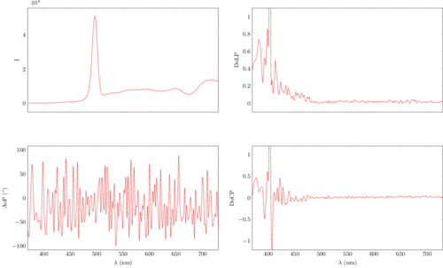

# polarimetryLab

## Spectopolar
This program computes spctropolarimetry.

**Outline** The program takes the six filtered spectra (i.e. anti-diagonal, vertical, diagonal, horizontal, lefthand circular, and righthand circular) and produces a csv file with the intensity, degree of linear polarization, angle of polarization, and degree of circular polarization per wavelength (in nm).

### Instructions
1. record the following 6 spectra: `l315c0`, `l0c0`, `l45c0`, `l90c0`, `l0c315`, `l0c45`, and `dark`. Where `dark` is an additional spectrum without the light source (but with the same integration time!). All these spectra files MUST have the same integration time. 
2. make sure you set an intigration time such that the maximum possible value in the wavelength interval of intrest is not saturated but isn't too low either. 
3. save the files as tab-delimited with a header.
4. make sure the appartus is pointing at the specimen and nothing else.
5. when done, double-click the `Spectopolar` icon .
6. the csv file and an additioal pdf plot of the results will be in the same folder where you saved the spectrum files.

